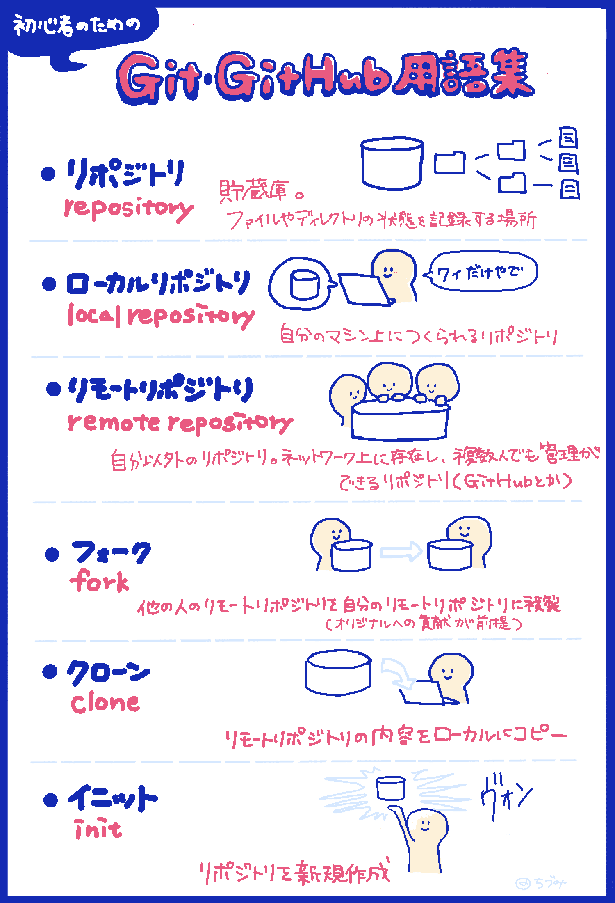
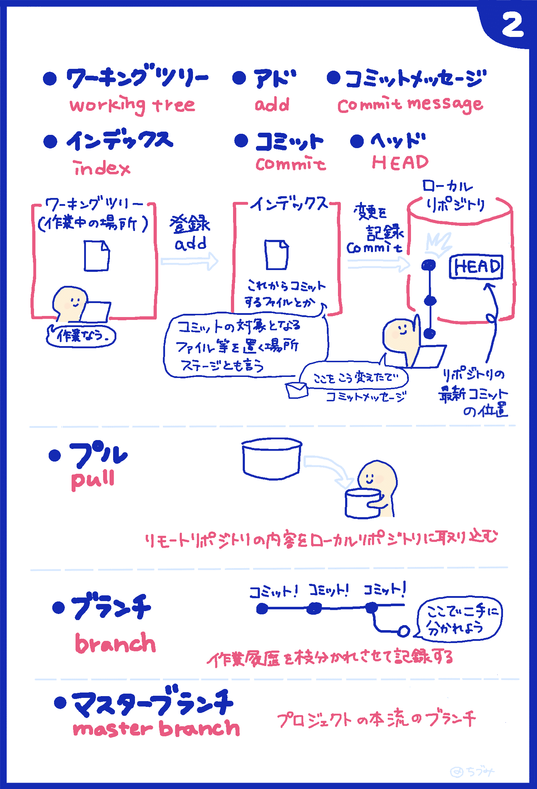
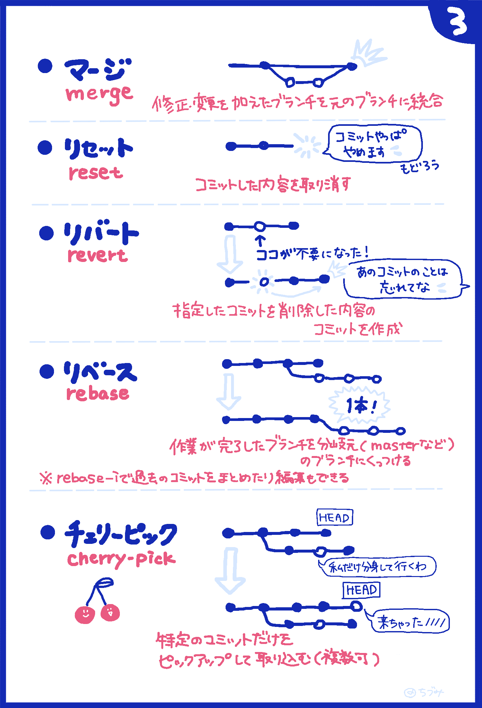
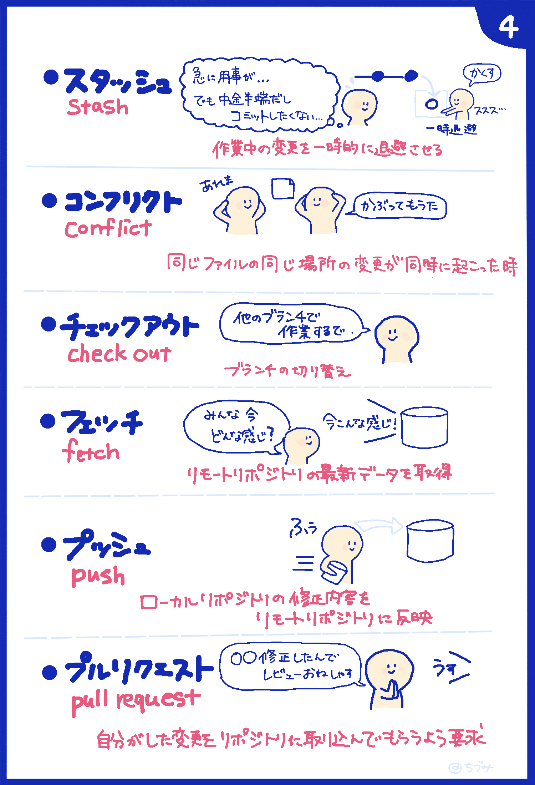

# 鹿児島.mk #3

connpass: [鹿児島.mk #3 GitとPull Requestを活用したチーム開発手法の紹介及び体験会](https://kagoshima-mk.connpass.com/event/150769/)

このイベントで使うリポジトリです。

Netlifyで公開しています。
https://silly-cray-a8656a.netlify.com/

## 準備

- マシンにGitをインストールする
- GitHubに登録する

※ここではインストール方法は解説しません。ググると解説記事がたくさん見つかります。

GitHubに登録したら、アカウントを主催者陣に教えてください。
このリポジトリのコラボレータに招待します。

## 今回やること

イベントページにもある通り、Git/GitHubを使ったチーム開発を体験します。

まず「Git/GitHubってなに？どんな感じで使うの？」を簡単に説明したあと、
実際に開発を体験してもらいます。

## [GitとGitHub用語集](https://zukulog098r.com/git/)

### 開発の流れ

1. リポジトリのissueを確認して、自分がやると宣言する
1. リポジトリをローカルマシンにclone
1. `index.html`をブラウザで開く
1. ボタンが並んでいるので、自分が対応するボタンを確認
1. ローカルで修正用ブランチを切る
1. 修正をcommitして、ブランチをGitHubにpushする
1. GitHub上でPull Requestを作成する
1. レビューを依頼する
1. レビューがOKならmasterブランチにmergeする
